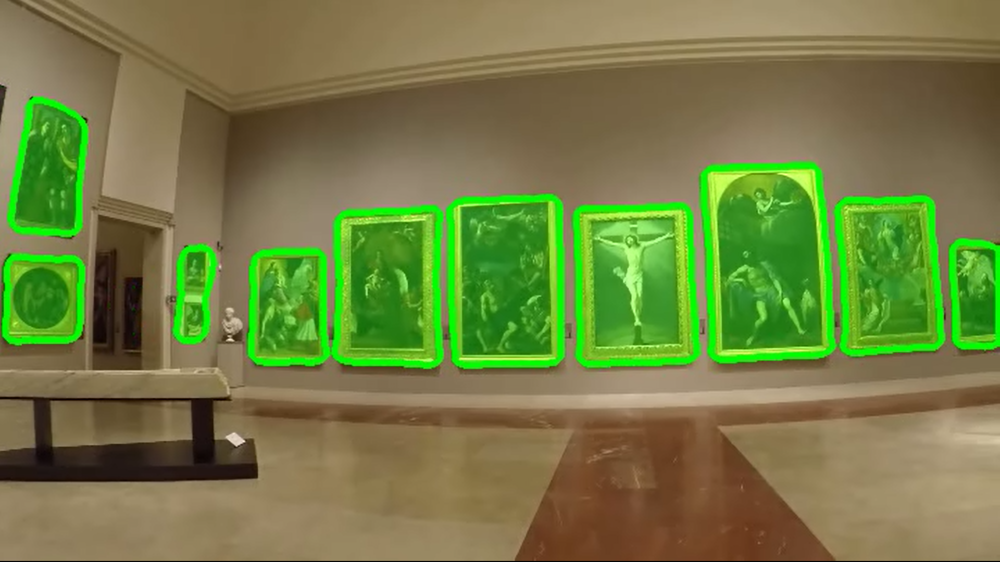

# CNN Architecture for Paintings Segmentation

## Demos:
- FCN-8: https://youtu.be/-QGkymGe-8U
- Our Resnet-50 based network (conf.1): https://youtu.be/LF1rz61kHhQ
- Our Resnet-50 based network (conf.2): https://youtu.be/KleN7qwM4x0

## Result:
 

## Italian ##

### Informazioni preliminari:
I pesi trainati (qualora non siano disponibili nella cartella /weights/)
sono disponibili a https://mega.nz/#!PFkwAK5K!dOA35n8Its7OpSVFWq1ZGsHxTrjKFBa1iPqH1QMn0_0

In caso di problemi di requisiti è provvisto il file 'requirements.txt', si consiglia di creare un conda/venv
ove installare tutti i pacchetti necessari.

Conda:\
conda create --name torch --file requirements.txt\
conda activate torch

venv:\
virtualenv torch \
source torch/bin/activate\
python -m pip install -r requirements.txt\
(non testato, si consiglia conda)

Per visualizzare l'output dei modelli proposti è disponibile lo script 'make_demo.py'
i parametri richiesti sono:

* [--source, -s] il path dell'immagine o video da processare, alternativamente è possibile specificare
  una directory contenente immagini da essere processate in batch (non supportato per video).
* [--device, -d] il device da utilizzare per il calcolo, 'cpu' o 'cuda' (default: cpu)
* [--net, -n] la rete da testare, 'fcn8' oppure 'our1' oppure 'our2' (default: ou1)
* [--weights, -w] il path dei pesi trainati per la rete (Fondamentale)
* [--out, -o] il file di destinazione SENZA ESTENSIONE (di default l' estensione sarà la stessa del file in ingresso,
  default: out.[estensione ingresso]

 ### Esempio: ###
    make_demo.py -s gitaalmuseo.png -w ../pesi/our.pth -d cuda -o /home/pippo/Scrivania/videofighissimo

 ### IMPORTANTE: ###
    Per quanto riguarda il video verà prodotto unicamente un video analogo con la visualizzazione delle classi
    ottenute dalla rete, per le immagini invece verrà prodotta anche una sotto cartella /pictures/ contenente
    immagini delle regiorni di interesse identificate dalla maschera di segmentazione (si spera).
